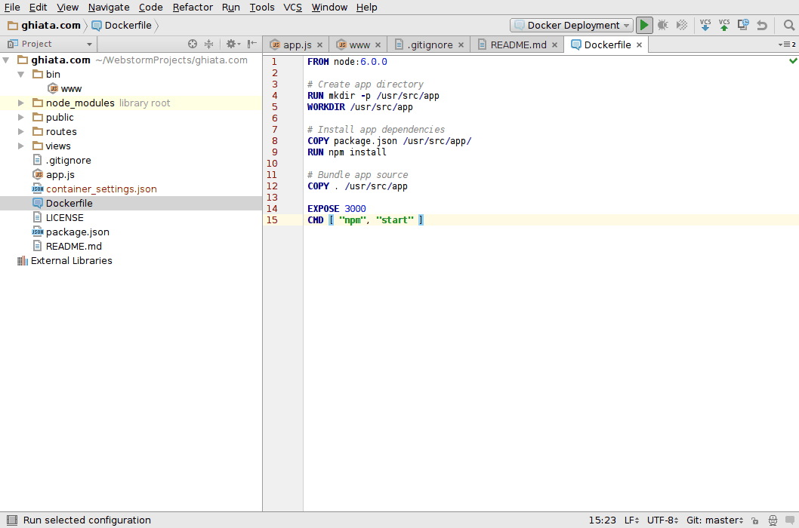

# nodejs-docker
running a nodejs app within docker

To start:

* ```$ docker build -t ghiata/nodejs```
* ```$ docker run -p 49160:3000 -d ghiata/nodejs```

-p maps host_port:container_port
-d runs container in detached mode (in _za_ background)

Example deployment from within indellij IDE:


